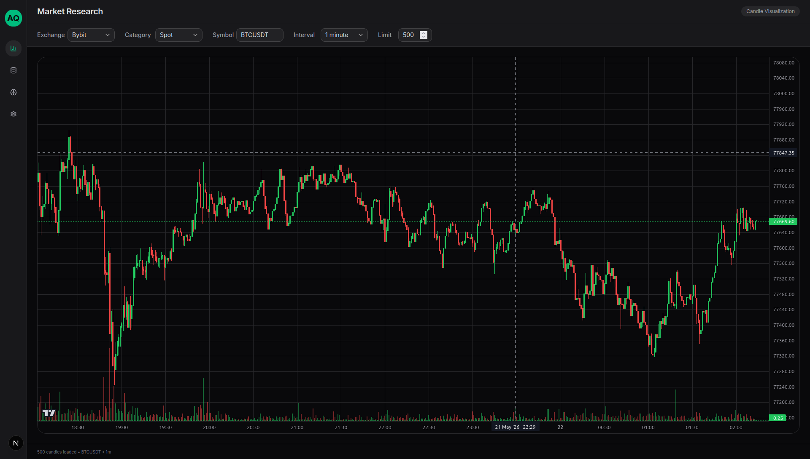
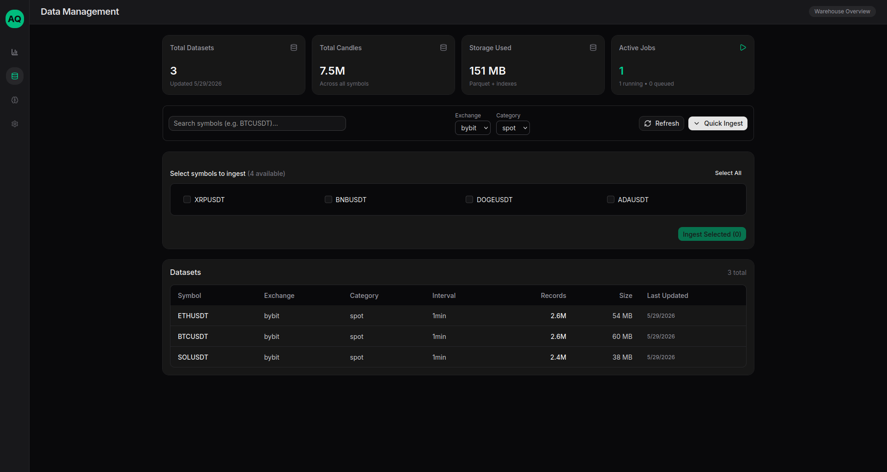

# Agentic Quant Studio

A workspace for building agentic AI systems in quantitative finance and Web3.

<div align="center">
  
</div>

---

## What exists today

This repo is an **early-stage data platform**, not yet an agentic workspace. There is no chat, no RAG, no backtesting engine, and no on-chain integration in the codebase. What works end-to-end today:

- **Parquet warehouse** — Hive-style paths (`exchange/category/symbol/interval/...`), catalog scan, candle read/resample
- **Rust backend** — Axum API for candles, catalog, and a generic background job queue
- **Next.js frontend** — two pages: Market Research (`/`) and Data Management (`/data`)
- **Studio crate** — declarative `GraphSpec` for agent-composed computation graphs (chart indicators first; strategy later)

The name reflects the **long-term vision** (see [Vision](#vision)); the implementation is focused on reliable market data, chart UX, and the graph spec foundation for indicators and strategies.

---

## Current features

### Market Research (`/`)

- Candle chart ([TradingView Lightweight Charts](https://tradingview.github.io/lightweight-charts/)) backed by stored Parquet data
- Exchange / category / symbol / interval controls
- **Catalog-gated chart** — waits for `GET /catalog/candles` before loading candles; links to `/data` when no datasets exist for the selected market
- **Symbol select** — options from `getMarketSymbols()` (exchange + category); placeholder symbol until the catalog loads
- **Infinite history scroll** — scroll left to load older candles in pages (500 bars); debounced prefetch when fewer than 50 bars remain before the viewport; viewport position preserved when older bars prepend
- Resampling for intervals other than 1m (warehouse layer)

#### Chart stack (frontend)

Event-driven datafeed with a dedicated cache layer — chart components subscribe to typed events instead of fetching directly.

| Piece | Role |
|-------|------|
| `CandleDatafeed` | Paged fetch (`PAGE_SIZE` 500), generation guards against stale responses, `loadInitial` / `loadOlder` |
| `CandleCache` | Sorted, de-duplicated candle store per series; merge on prepend |
| `datafeedEvent.ts` | Maps events to series updates; `preserveViewportOnPrepend` keeps the visible window stable |
| `preserveViewport.ts` | History preload threshold and debounce (`150ms`) helpers |
| `useCandleChart` | Wires chart + datafeed; handles initial load lifecycle |
| `useChartHistoryScroll` | Subscribes to visible logical range; triggers `loadOlder()` |
| `useChartResize` | ResizeObserver sync for responsive chart layout |
| `CandleChartPanel` | Chart shell with loading / error overlays |

**Datafeed events:** `replace` (full window), `prepend` (older page), plus lifecycle signals `loading`, `paging`, `pageError`, `rangeBoundary` (start/end of available data), and `reset` (series change).

Run chart unit tests: `cd frontend && npm test` (datafeed, cache, viewport preservation, candle mapping)

### Data Management (`/data`)

The most developed UI:

- **KPI cards** — dataset count, total candles, storage, active jobs (derived from catalog + job API)
- **Datasets table** — searchable list from the catalog snapshot
- **Quick Ingest** — queue `ingest_candles` jobs for symbols not yet in the catalog (Bybit spot/linear today)
- **Active jobs** — pending/running counts from `GET /api/v1/jobs?active=true`

<div>
  
</div>

---

## Studio (`crates/studio`)

Foundation for agent-composed **computation graphs** — indicators, logic, and outputs now; strategies on the same model later.

**Spec:**

- **`GraphSpec`** — serializable graph: `id`, `version`, `kind`, `nodes[]`, `edges[]`
- **`GraphKind`** — graph intent (`chart` today; `strategy` planned)
- **`NodeSpec`** — `id`, `kind` (registry key), `params` (JSON)
- **`Edge`** — port-to-port wiring via `PortRef` (`node_id.port_name` in JSON)

**Runtime:**

- **`validate`** — node ids, registry kinds, port types, unique input wires, acyclic graph
- **`execute`** — topological execution into a `PortStore`
- **`NodeRegistry`** / **`NodeOp`** — pluggable node ops with port/param metadata
- **Built-in ops** — `datasource.candles`, `indicator.sma`, `output.series`, `output.signal`
- **`ExecutionContext`** / **`CandleSource`** — async candle loading for data-source nodes

UI metadata (node positions, labels, editor groups) will live in a separate **`GraphExtSpec`** later — not mixed into `GraphSpec`. Backend Parquet wiring (`WarehouseCandleSource`) is next.

See [`crates/studio/README.md`](crates/studio/README.md) for API usage and a runnable subgraph example.

```bash
cargo test -p studio
```

---

## Background jobs

Ingestion and future async work go through a **generic job system** (`crates/backend/src/jobs/`), not candle-specific routes.

| Piece | Role |
|-------|------|
| `Job` enum | Tagged JSON (`type` + `payload`); extensible for new job kinds |
| `JobQueue` | In-memory status (`DashMap`) + `mpsc` channel to a single worker |
| `processors/` | Per-type handlers (today: `ingest_candles`) |

**Implemented job type:** `ingest_candles` — downloads candle history (full or incremental from last Parquet timestamp), then refreshes the catalog.

**Limitations (important):**

- Jobs live **in memory only** — restart the backend and job history is gone
- **One worker**, jobs run **sequentially**
- Duplicate active jobs (same kind + payload signature) return **409 Conflict** with the existing job id
- Catalog refresh after ingest is automatic; `POST /catalog/candles/refresh` is a separate **fire-and-forget** task (not tracked as a job)

---

## Backend API (v1)

Base path: `/api/v1`. Default server: `http://127.0.0.1:3000` (see [Getting started](#getting-started) for ports).

| Method | Endpoint | Description |
|--------|----------|-------------|
| GET | `/candles/{exchange}/{category}/{symbol}/{interval}` | Load historical candles from Parquet — optional query: `?start=`, `?end=`, `?limit=`; **404** if the dataset path does not exist |
| POST | `/jobs` | Enqueue a job (JSON body, see below) |
| GET | `/jobs` | List jobs — `?kind=`, `?active=true`, `?status=pending,running`, `?limit=` (max 500) |
| GET | `/jobs/{id}` | Single job status |
| GET | `/catalog/candles` | Full catalog snapshot |
| POST | `/catalog/candles/refresh` | Background catalog rescan (202, no job record) |

### Create job example (`ingest_candles`)

```bash
curl -X POST http://127.0.0.1:3000/api/v1/jobs \
  -H "Content-Type: application/json" \
  -d '{"type":"ingest_candles","payload":{"exchange":"bybit","category":"spot","symbol":"SOLUSDT"}}'
```

### List active ingestion jobs

```bash
curl -s "http://127.0.0.1:3000/api/v1/jobs?active=true&kind=ingest_candles" | jq
```

Job statuses: `pending`, `running`, `completed`, `failed`, `cancelled`.

---

## Data sources

- **Exchange:** Bybit only (`Exchange::Bybit` in `crates/common`)
- **Storage:** local Parquet under `parquet_base_dir` (default `/tmp/agentic-quant-studio/parquet`, overridable via config)

---

## Tech stack

| Layer | Stack |
|-------|--------|
| Backend | Rust, Axum, Tokio |
| Studio | Computation graph spec (`GraphSpec`); runtime WIP |
| Jobs | In-process queue + worker (not Redis/Sidekiq) |
| Warehouse | Parquet, Polars, custom catalog |
| Frontend | Next.js 16, React Query, Zustand, shadcn/ui, Lightweight Charts, Vitest |

**Not in the repo yet:** agent framework (e.g. Rig), RAG, backtesting, Web3 / ERC-8004, MLOps.

---

## Getting started

```bash
git clone https://github.com/wizard50/agentic-quant-studio.git
cd agentic-quant-studio
```

### Backend

```bash
cargo run -p backend
```

Listens on `127.0.0.1:3000` by default (`config/defaults.toml`). Override via `~/.config/agentic-quant-studio/config.toml` or env vars prefixed with `AGENTIC_QUANT_STUDIO__` (see `config/example.toml`).

### Frontend

The UI proxies API calls through Next.js: `/api/backend/v1/...` → backend `/api/v1/...` (`frontend/next.config.ts`).

**Port note:** both backend and Next.js default to port **3000**. In development, run them on different ports, for example:

```bash
# Terminal 1 — backend on 3000
cargo run -p backend

# Terminal 2 — frontend on 3001, pointing at backend
cd frontend
npm install
NEXT_PUBLIC_BACKEND_URL=http://127.0.0.1:3000 npm run dev -- -p 3001
```

Open http://localhost:3001 — Data Management is at `/data`.

### Example API usage

```bash
# Catalog size
curl -s http://127.0.0.1:3000/api/v1/catalog/candles | jq '.datasets | length'

# Load candles (path = dataset identity; query = optional window/limit)
curl -s "http://127.0.0.1:3000/api/v1/candles/bybit/spot/BTCUSDT/1m?limit=100" | jq 'length'
```

---

## Project structure

```
/
├── config/              # defaults.toml, example.toml
├── crates/
│   ├── api-client/
│   ├── backend/
│   │   └── src/
│   │       ├── handlers/       # candles, catalog, jobs
│   │       ├── jobs/           # queue, worker, types, processors
│   │       └── services/       # candle_service, etc.
│   ├── common/                 # shared types (Exchange, candles, …)
│   ├── studio/                 # GraphSpec + runtime (validate, execute, nodes)
│   └── warehouse/              # Parquet I/O, catalog builder, downloader
├── frontend/
│   ├── app/
│   │   ├── data/                      # Data Management
│   │   └── page.tsx                   # Market Research
│   ├── components/chart/
│   │   ├── CandleChartPanel.tsx       # chart panel + status overlays
│   │   └── NoDatasetsMessage.tsx      # empty-catalog guidance
│   ├── hooks/
│   │   ├── chart/                     # useCandleChart, history scroll, resize
│   │   ├── useCatalog.ts              # catalog snapshot + getMarketSymbols()
│   │   └── useJobs.ts                 # job list + active job summary
│   └── lib/chart/                     # datafeed, cache, events, viewport helpers
└── README.md
```

---

## Vision

Long-term goal: an intelligent workspace where users interact with AI agents (chat, later voice) to:

- Run quantitative research and backtesting
- Generate indicators, strategies, and dashboards
- Analyze DEX pools and on-chain data
- Use RAG on documents and private knowledge bases
- Register and run autonomous on-chain agents (ERC-8004 / Solana)

None of that is implemented yet; the current milestone is **reliable market data ingest + catalog + chart UX + `GraphSpec` foundation** for agent-composed indicators and strategies.

---

## License

This project is licensed under the [MIT License](LICENSE).

---

Built by [@wizard50](https://github.com/wizard50)
