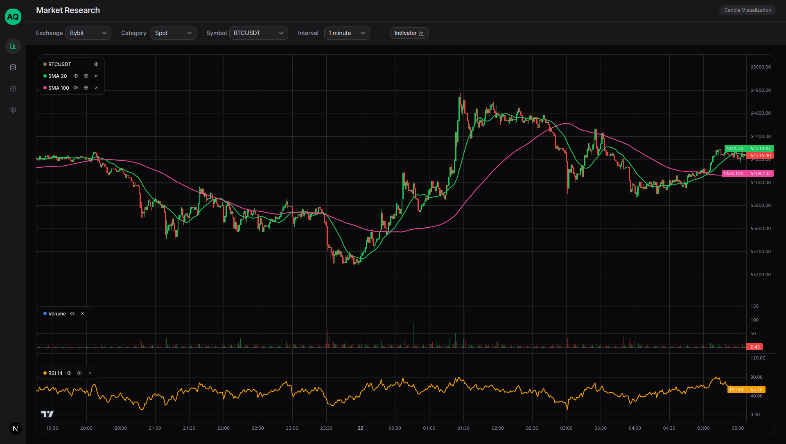
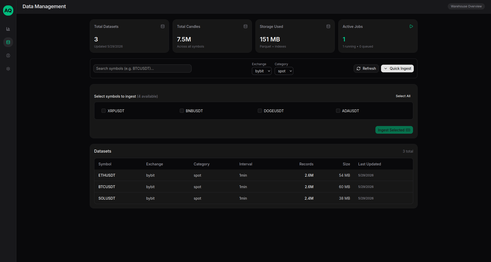

# Agentic Quant Studio

A workspace for building agentic AI systems in quantitative finance and Web3.

<div align="center">
  
</div>

---

## What exists today

This repo is an **early-stage data platform**, not yet an agentic workspace. There is no chat, no RAG, no backtesting engine, and no on-chain integration in the codebase. What works end-to-end today:

- **Warehouse** — Hive-partitioned Parquet, catalog scan, read/resample ([`crates/warehouse/README.md`](crates/warehouse/README.md))
- **Backend** — Axum API, jobs, catalogs, studies ([`crates/backend/README.md`](crates/backend/README.md))
- **Frontend** — Market Research + Data Management ([`frontend/README.md`](frontend/README.md))
- **Studio** — `GraphSpec` + runtime + indicator catalog ([`crates/studio/README.md`](crates/studio/README.md))
- **MCP server** — stdio tools for external agents over the backend API ([`crates/mcp-server/README.md`](crates/mcp-server/README.md))

The name reflects the **long-term vision** (see [Vision](#vision)); the implementation is focused on reliable market data, chart UX, and the graph spec foundation for indicators and strategies.

---

## Current features

### Frontend

Two pages: **Market Research** (`/`) — LW Charts candle view with catalog-driven indicators; **Data Management** (`/data`) — ingest, datasets, jobs.

The chart uses a **layer document → compiled `ChartBlockSpec` → studio run** pipeline. Indicator metadata comes from `GET /catalog/indicators`; the UI hydrates a runtime registry on load.

Details — architecture, components, datafeed, tests, dev setup: **[`frontend/README.md`](frontend/README.md)**

<div>
  
</div>

---

## Backend & data

HTTP API at `/api/v1` (candles, catalogs, jobs, studio runs). Ingestion uses an in-process job queue; candles live in local Parquet (Bybit only today).

Details — endpoints, curl examples, jobs, config: **[`crates/backend/README.md`](crates/backend/README.md)**

Warehouse layout, catalog, resampling: **[`crates/warehouse/README.md`](crates/warehouse/README.md)**

## Studio

Declarative **`GraphSpec`** + validate/execute runtime. Powers `POST /studio/runs` and `GET /catalog/indicators` (via `IndicatorCatalog` + `chart_defaults`).

Details — spec types, built-in nodes, examples: **[`crates/studio/README.md`](crates/studio/README.md)**

---

## Tech stack

| Layer | Stack |
|-------|--------|
| Backend | Rust, Axum, Tokio |
| Studio | Computation graph spec (`GraphSpec`); runtime WIP |
| Jobs | In-process queue + worker (not Redis/Sidekiq) |
| Warehouse | Parquet, Polars, custom catalog |
| Frontend | Next.js 16, React Query, Zustand, shadcn/ui, Lightweight Charts, Vitest |

**Not in the repo yet:** agent framework (e.g. Rig), RAG, backtesting, Web3 / ERC-8004, MLOps.

---

## Getting started

```bash
git clone https://github.com/wizard50/agentic-quant-studio.git
cd agentic-quant-studio
```

### Backend

```bash
cargo run -p backend
```

Config and API examples: **[`crates/backend/README.md`](crates/backend/README.md)**

### Frontend

**[`frontend/README.md`](frontend/README.md)** — dev server (use a different port than the backend), chart architecture, `npm test`.

---

## Project structure

```
/
├── config/              # defaults.toml, example.toml
├── crates/
│   ├── api-client/      # exchange clients (Bybit)
│   ├── backend/         # Axum API — see crates/backend/README.md
│   ├── common/          # shared types
│   ├── studio/          # GraphSpec + runtime — see crates/studio/README.md
│   └── warehouse/       # Parquet + catalog — see crates/warehouse/README.md
├── frontend/            # Next.js UI — see frontend/README.md
└── README.md
```

---

## Vision

Long-term goal: an intelligent workspace where users interact with AI agents (chat, later voice) to:

- Run quantitative research and backtesting
- Generate indicators, strategies, and dashboards
- Analyze DEX pools and on-chain data
- Use RAG on documents and private knowledge bases
- Register and run autonomous on-chain agents (ERC-8004 / Solana)

None of that is implemented yet; the current milestone is **reliable market data ingest + catalogs + chart UX with dynamic indicators + `GraphSpec` foundation** for agent-composed strategies.

---

## License

This project is licensed under the [MIT License](LICENSE).

---

Built by [@wizard50](https://github.com/wizard50)
